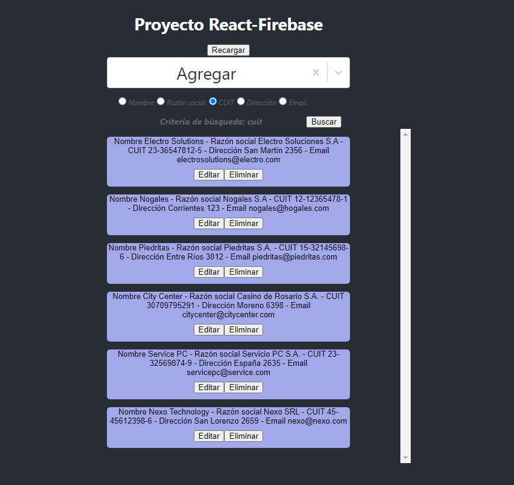

# Firebase React Proyect
This project was created as part of challege to create a SPA that work with React JS and Firebase Data Base. In the screen you can see some options to find results, create, edit and delete records. Nevertheless, this SPA have other features, for exemple you can select a filter to improve your query and get best results. Aditionally, you can access two forms to create and edit information, and popups that alert you the action performed.\
I invite you to test my SPA and its features. I hope that you enjoy it.\
Best regards,\
Fernando.

Open deploy here [Firebase-React-Project](https://react-firebase-project-one.vercel.app/)

## Available Scripts

In the project directory, you can run:

### `npm start`

Runs the app in the development mode.\
Open [http://localhost:3000](http://localhost:3000) to view it in your browser.

The page will reload when you make changes.\
You may also see any lint errors in the console.
